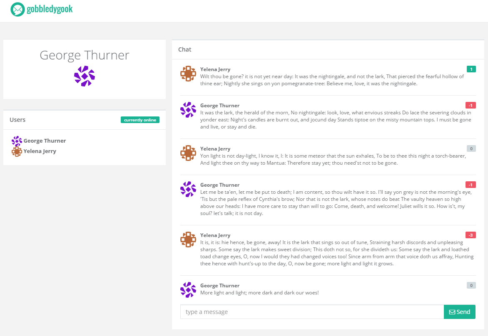

# Gobbledygook
Demo of a real-time chat application designed using **microservice architecture** and built with [emitter](http://emitter.io), [rancher](http://rancher.com), [appVeyor](http://appveyor.com) and [docker](http://docker.com).

## Vbox Virtual Machines
* 3 empty virtual machines: https://s3.amazonaws.com/cdn.misakai.com/vm/gobbledygook.rar
* 3 final virtual machines: https://s3.amazonaws.com/cdn.misakai.com/vm/gobbledygook-final.rar
